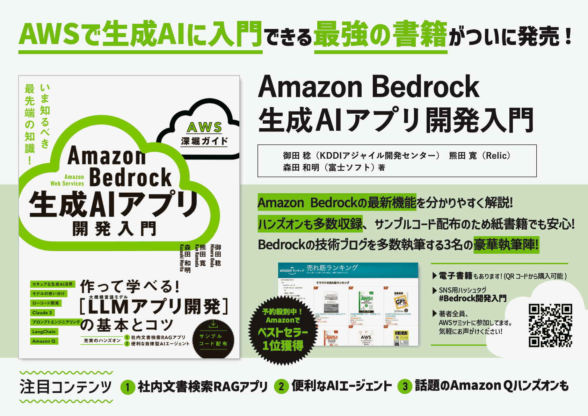

# 書籍「Amazon Bedrock 生成AIアプリ開発入門」 ハンズオン用サンプルコード

表題の書籍のハンズオンを実施しやすいよう、サンプルコード部分をファイルとして格納したリポジトリです。

- 紙の書籍を購入くださった方も、コピー＆ペーストが可能になります。
- 今後の環境変化でコードに不具合が生じた際、適宜改修していきます。

## 📗 このGitHubリポジトリの説明

### 書籍について

まだお持ちでない方は、ぜひお買い求めください！

[Amazon Bedrock 生成AIアプリ開発入門](https://www.sbcr.jp/product/4815626440/)

### このリポジトリの構成

- `chapter⚫️` ディレクトリ ：各章のハンズオン用コードや、手打ちが大変な設定値などを格納しています。
  - 必要なPythonライブラリを記載した `requirements.txt` も、参考までに格納しています。
  - 書籍刊行後の機能アップデートへの対応方法などを `README.md` にて補足しています。

### エラー等を見つけた際は

本リポジトリの [Issues](https://github.com/minorun365/bedrock-book/issues) へ起票ください。ベストエフォートで対応します。

### 誤植などのお知らせ

[SBクリエイティブ公式サイト](https://www.sbcr.jp/product/4815626440/) にて、正誤情報を適宜掲載します。

## ✨ 書籍刊行後のアップデート補足

### ■ 新モデル追加（対象：第2章ほか）

#### 【2024/6/20】 Anthropic社の新モデル「Claude 3.5 Sonnet」がリリース！

Anthropic社の新モデルで、Claude 3 Sonnetの後継となります。性能・コストともにClaude 3 Opusをも上回るとされています。

- https://qiita.com/minorun365/items/cd46235d5e446b1f41c5

本書のハンズオンへの取り込み方法

- 書籍P.80を参考に `Claude 3.5 Sonnet` をバージニア北部リージョンのBedrockで有効化する
  - 非常に需要が高いため、「利用不可」ステータスとなり有効化できないことがあります。その際は日にちをおいてリトライください
- 各章のサンプルコードにおいて、Claude 3 SonnetのモデルIDを指定している箇所を、Claude 3.5 SonnetのモデルID（`anthropic.claude-3-5-sonnet-20240620-v1:0`）に置き換える

注意点

- Bedrockでは、GUIやAPI経由での単体モデル呼び出しに対応していますが、応用機能（ナレッジベースやエージェント）へは未対応です（2024/6/20時点）。
- Knowkedge bases for Amazon Bedrockにおいては、 `Retrieve` APIを利用すればClaude 3.5 Sonnetをすぐに活用できます（書籍P.216参照）。

#### 【2024/6/26】 AI21 Labs社の新モデル「Jumba-Instruct」がリリース

同社の既存モデル「Jurassic-2」シリーズを上回る高性能モデル。256Kトークンという大容量のコンテキストウィンドウに対応。言語は英語のみ。

- https://aws.amazon.com/jp/blogs/machine-learning/ai21-labs-jamba-instruct-model-is-now-available-in-amazon-bedrock/

#### 【2024/7/24】 Meta社の新モデル「Llama 3.1」シリーズがリリース

同社の既存モデル「Llama 3」シリーズの後継モデル。405Bパラメーター版はプレビュー（利用申請が必要）

- https://qiita.com/minorun365/items/e75b57ed360cbced5827

#### 【2024/7/25】 Mistral社の新モデル「Mistral Large 2」がリリース

- https://aws.amazon.com/jp/blogs/machine-learning/mistral-large-2-is-now-available-in-amazon-bedrock/

#### 【2024年7月】 Claude 3シリーズがAWS東京リージョンに対応予定

参考記事（クラウドWatch）

- [AWS、Claude 3やAmazon Q for Business日本語版の東京リージョンでの提供時期などを明らかに - クラウド Watch](https://cloud.watch.impress.co.jp/docs/event/1601745.html)

### ■ Bedrock応用機能のアップデート（対象：第4〜6章ほか）

#### 【2024/7/11】 生成AI関連の大型アップデート多数（Bedrock、Amazon Q、ほか新サービスなど）

解説スライドを公開しています。本書を読まれた方は、アップデートをより理解しやすいと思います！

- [宇宙最速で7/11未明のAmazon Bedrock大型アプデを解説 🚀 - Speaker Deck](https://speakerdeck.com/minorun365/11wei-ming-noamazon-bedrockda-xing-apudewojie-shuo)

### ■ Amazon Qのアップデート（対象：第9章）

#### 【2024年内】 Amazon Q Businessが日本語およびAWS東京リージョンに対応予定

参考記事（クラウドWatch）

- [AWS、Claude 3やAmazon Q for Business日本語版の東京リージョンでの提供時期などを明らかに - クラウド Watch](https://cloud.watch.impress.co.jp/docs/event/1601745.html)

## 💻 読者のみなさまの書評ブログ紹介

たくさんの素敵なアウトプット、ありがとうございます！！🙇‍♂️

- おむろんさん [「Amazon Bedrock生成AIアプリ開発入門」本の感想を宇宙最速で述べる #Bedrock開発入門 - omuronの備忘録](https://omuron.hateblo.jp/entry/2024/06/18/151000)
- cyberBOSEさん [「Amazon Bedrock 生成AIアプリ開発入門」レビュー #Bedrock開発入門 #Python - Qiita](https://qiita.com/cyberBOSE/items/c2b0a2885b79f4d10f5d)
- s.hirutaさん [Bedrock開発入門書籍レビュー | クラウドインフラ構築記](https://www.totalsolution.biz/bedrock%e9%96%8b%e7%99%ba%e5%85%a5%e9%96%80%e6%9b%b8%e7%b1%8d%e3%83%ac%e3%83%93%e3%83%a5%e3%83%bc/)
- hmatsu47さん [Amazon Bedrock 生成 AI アプリ開発入門［AWS 深掘りガイド］の紹介 - 構築中。](https://hmatsu47.hatenablog.com/entry/2024/06/19/210808)
- Renya K.さん [「Amazon Bedrock」で始める生成AIアプリ開発入門バイブルの登場！！ #AWS - Qiita](https://qiita.com/ren8k/items/6134d2457211e5a285c4)
- hayao_kさん [Amazon Bedrock 生成AIアプリ開発入門 レビュー #Bedrock開発入門 #AWS - Qiita](https://qiita.com/hayao_k/items/fcd4d9921510ead0fee3)
- 星野ぽぽぽさん [【書評】Amazon Bedrock 生成 AI アプリ開発入門｜星野ぽぽぽ(noteのすがた)](https://note.com/hoshino_popopo_/n/nbef8bb5cc07f)
- kazzpapa3さん [Amazon Bedrock 生成AIアプリ開発入門 の書評 という名の雑記 - ほぼ自分のための備忘録ブログ](https://blog.kazzpapa3.com/blog/2024/06/26/amazon-bedrock-ai/)
- 石原直樹さん [「Amazon Bedrock 生成AIアプリ開発入門」 レビュー #Bedrock開発入門 #AWS - Qiita](https://qiita.com/Naoki_Ishihara/items/589e8ac423ed2a5ffcee)
- kzk_maedaさん [Bedrock開発入門を読みました｜kzk_maeda](https://note.com/kzk_maeda/n/nffa11ccb9389?sub_rt=share_pb)
- 山本紘暉さん [【書評】Amazon Bedrock 生成AIアプリ開発入門 [AWS深掘りガイド] | DevelopersIO](https://dev.classmethod.jp/articles/book-review-amazon-bedrock-genai-app-dev-intro/)
- つくぼしさん [AWSにおける生成AIアプリ開発を学ぶには最適の入門書「Amazon Bedrock 生成AIアプリ開発入門」 | DevelopersIO](https://dev.classmethod.jp/articles/review-bedrock-genai-app-dev-intro/)
- 平野文雄さん [「Amazon Bedrock 生成AIアプリ開発入門」のススメ | DevelopersIO](https://dev.classmethod.jp/articles/recommend-bedrock-genai-app-dev-intro/)
- Akihiro Uenoさん [『Amazon Bedrock 生成AIアプリ開発入門』の感想をば](https://zenn.dev/ueniki/articles/50c73a94b186ce)
- yuki_inkさん [『Amazon Bedrock 生成AIアプリ開発入門』 から始めるAIエージェント #AWS - Qiita](https://qiita.com/yuki_ink/items/097bbe9893359e12996f?utm_campaign=post_article&utm_medium=twitter&utm_source=twitter_share)
- しまさん [【感想】『Amazon Bedrock 生成AIアプリ開発入門』を読みました](https://zenn.dev/os1ma/articles/27bf3bd821065d)
- issyさん [書籍「Amazon Bedrock 生成AIアプリ開発入門-第４章-」 × AWS Summit Japan 2024](https://zenn.dev/issy/articles/bedrock-book-aws-summit-2024)
- Shinodaさん [書評「Amazon Bedrock 生成AIアプリ開発入門」｜Shinoda](https://note.com/yukkie1114/n/nb97f45b13a2f)
- MK_Techさん [『感想』Amazon Bedrock生成AIアプリ開発入門 #AWS - Qiita](https://qiita.com/MK_Tech/items/a443fb394abbeb2bae60)
