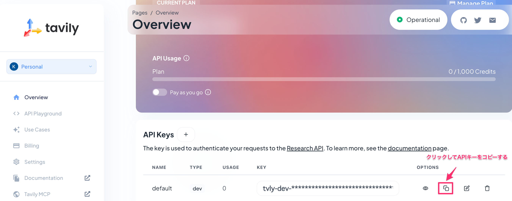

# 5.2 LangChaindでAIエージェントを実装してみよう

> [!NOTE]
> 💡 本ディレクトリーは検索にTavilyAPIを用いたソースを配置しています。

書籍ではDuckDuckGoを用いた検索AIエージェントの実装について記載していますが、現在RateLimitエラーの問題が頻発していることから。
Tavilyを活用したソースコードも別途ご用意しました。
※TavilyのAPIは無料プランで月あたり1,000回まで利用することが出来ます。

## ライブラリインストール

以下のコマンドを実行して、ライブラリをインストールしてください。

```shell
pip install -r requirements_langchain-0.3.0.txt
```

# TavilyAPIを取得

[Tavily公式サイト](https://www.tavily.com/)にアクセスしてアカウントを作成してください。

アカウントを作成後、デフォルトで払い出されているAPIKeyをコピーしてください。



※echoコマンドでセットしたAPIキーを表示されればOKです。

```shell
export TAVILY_API_KEY=<your api key>
echo $TAVILY_API_KEY
```