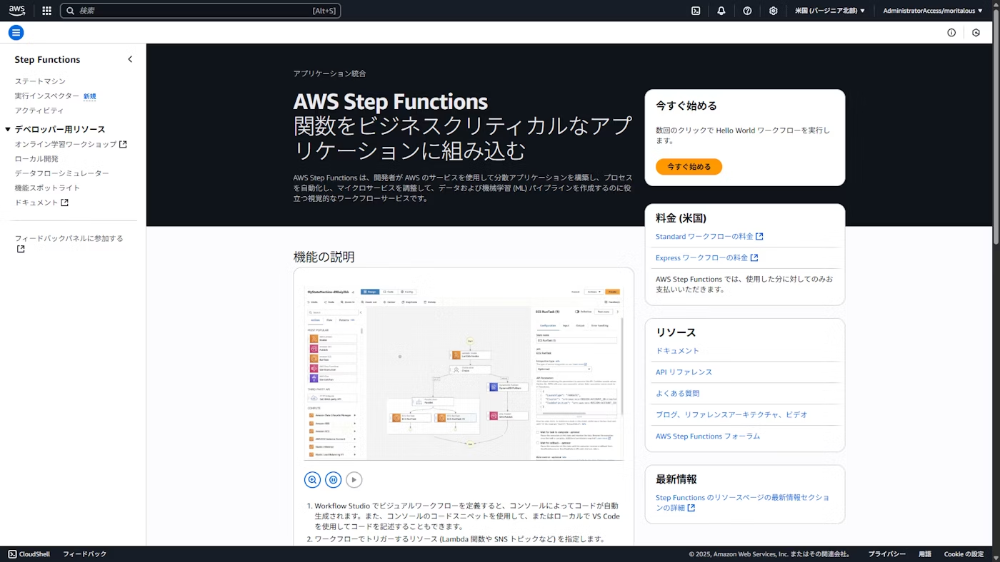
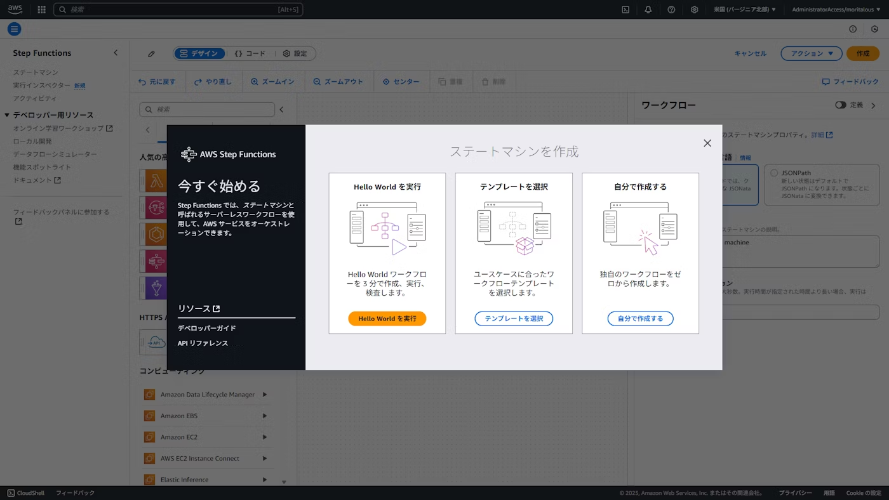
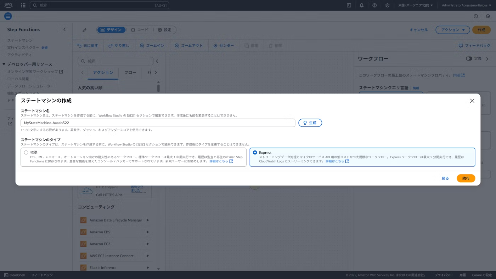
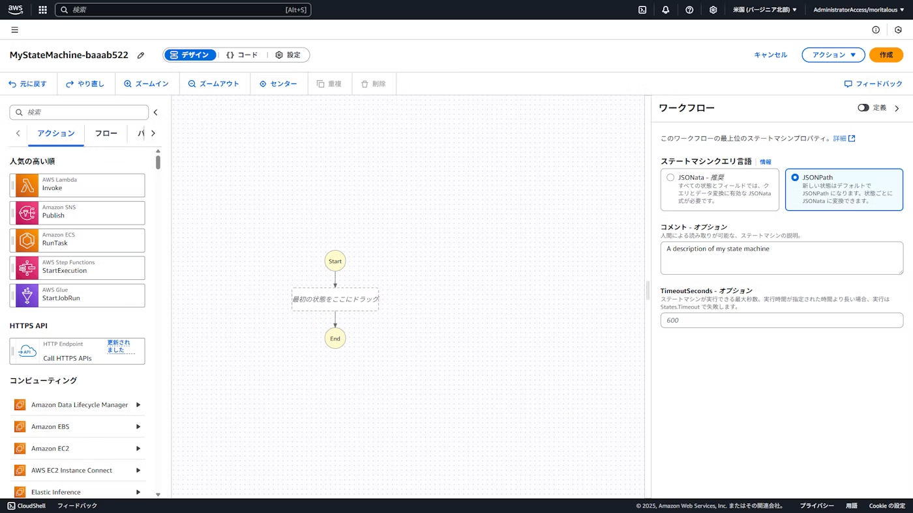

## 8.2 BedrockとStep Functionsを使った生成AIアプリ開発

2025/7/12追加：AWS Step Functionsのアップデートにより、ハンズオン実施手順が変更になります。

P.386の「タスクを作成する」

1. 最初にStep Functionsでタスクを作成します。マネジメントコンソールで「Step Functions」の画面を表示して、「今すぐ始める」ボタンをクリックします。
    

1. 「自分で作成する」ボタンをクリックします。
    

1. ステートマシン名に「Bedrock-StateMachine」と入力し、ステートマシンのタイプを「 Express 」に変更します。「続行」をクリックします。
    

1. 右側のワークフローのステートマシンクエリ言語を「JSONPath」に変更します。
    

P.387の「Workflow Studioの編集画面が表示されるので、」以降を実施してください。
